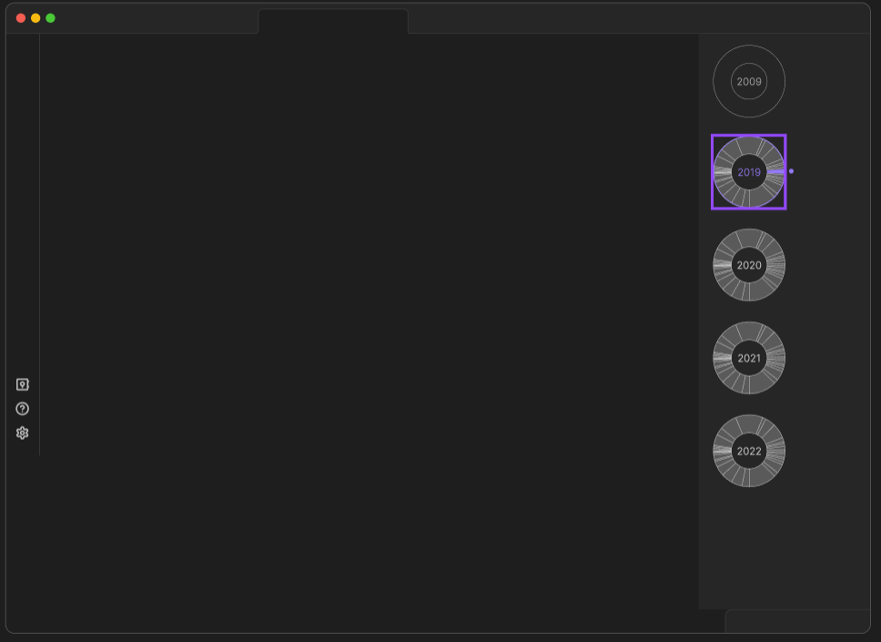
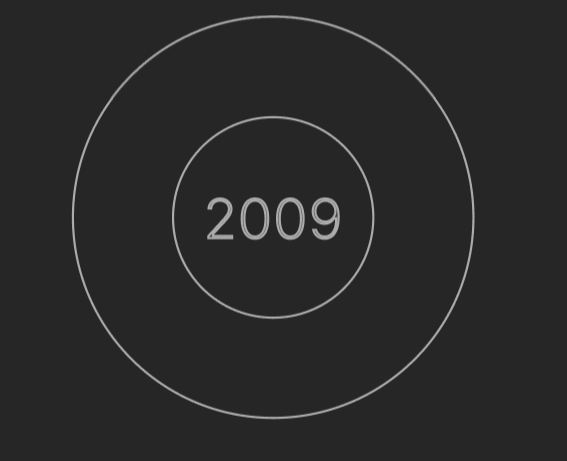

# Phase 0: Requirements

## Vision

Journaling with the daily notes in Obsidian is a great tool to improve your relationship with yourself.  Scrolling through the past entries throughout the past several years works okay. 

I want to create a visualization plugin of what year and month you were writing in. This could help the user have more context in what time of their life they were writing some entry in.

## What should it look like?

The right sidebar should have an icon you can click on and it would then display the timeline

The timeline will be a column of circles. Each circle represents a year. Each year will be a pie chart of Daily notes. The position around the circle correponds to when during the year the note was. If the note was during January it will be at 12:00 and February will be to the right of that etc.

The selected year will have a interactive accent color around the circle, and filled in the time slice. There will be a small purple circle floating adjacent to the slice to emphasize the selected time slice.

**Too many time slice problem:**
If the circle has too many time slices to display well, we will group several notes into the same time slice. On click of the time slice just pull up a random note from that slice.  I am not positive about this solution but it seems the best for now.



I am not so sure about the size of the circles. Ideally I would want an option to zoom in or out.

 


## Building the project

**Data used by the program**
- Location of Daily Notes Directory
    - All daily notes titles
    - Format of daily note title ("YYYY-MM-DD")
- Current file open

**What I already know how to do.**
- Querey files
- Research documentation

**Challenges I foresee.**
- making the circle 
- formatting for mobile
- understanding when obsidian loads the plugin
- learning the obsidian API

## Phase 1: Design

- get the data we need
- check if the display is needed
    - display the thing


**main.py**
```python
# Import necessary modules and classes
import obsidian
from timeline_visualization import TimelineVisualization

# Create an instance of the Obsidian API
obsidian_api = obsidian.ObsidianAPI()

# Create an instance of the TimelineVisualization
timeline = TimelineVisualization(obsidian_api)

# Add the timeline icon to the right sidebar
timeline.add_icon_to_sidebar()

# Define a function to handle the click event on the timeline icon
def on_timeline_icon_click():
    # Show or hide the timeline visualization
    timeline.toggle_visibility()

# Register the click event for the timeline icon
obsidian_api.register_click_event('timeline-icon', on_timeline_icon_click)
```

**visualization.py**
```python
# Import necessary modules and classes
import matplotlib.pyplot as plt
import random

class TimelineVisualization:
    def __init__(self, obsidian_api):
        self.obsidian_api = obsidian_api
        self.is_visible = False

    def add_icon_to_sidebar(self):
        # Add an icon to the right sidebar
        # ...

    def toggle_visibility(self):
        # Show or hide the timeline visualization
        self.is_visible = not self.is_visible
        if self.is_visible:
            self.show_timeline()
        else:
            self.hide_timeline()

    def show_timeline(self):
        # Display the timeline visualization
        # ...

    def hide_timeline(self):
        # Hide the timeline visualization
        # ...

    def handle_timeline_click(self, year, month):
        # Handle the click event on a specific time slice
        notes = self.obsidian_api.get_notes_for_time_slice(year, month)
        if len(notes) > 0:
            random_note = random.choice(notes)
            self.obsidian_api.show_note(random_note)

```

**overflow_slices.py**
```python
class TimeSliceManager:
    def __init__(self):
        # Define the maximum number of time slices to display
        self.max_time_slices = 12

    def group_time_slices(self, notes):
        # Group time slices if there are too many to display
        # ...

    def handle_time_slice_click(self, grouped_notes):
        # Handle the click event on a grouped time slice
        # ...
```

**create_timeline.js**
```javascript
// Define a TypeScript class for the timeline visualization
class TimelineVisualization {
    private timelineContainer: HTMLElement;

    constructor() {
        this.timelineContainer = document.getElementById('timeline-container');
    }

    // Function to show the timeline
    showTimeline() {
        this.timelineContainer.style.display = 'block';
        // Add logic to dynamically generate and position timeline circles here
        this.generateTimelineCircles();
    }

    // Function to hide the timeline
    hideTimeline() {
        this.timelineContainer.style.display = 'none';
    }

    // Function to generate timeline circles
    generateTimelineCircles() {
        // Add logic to create and append circles to the timelineContainer
        for (let i = 0; i < 5; i++) { // Example: Create 5 circles
            const circle = document.createElement('div');
            circle.className = 'circle';
            circle.addEventListener('click', () => this.handleCircleClick(i + 1)); // Example: Pass the year as an argument
            this.timelineContainer.appendChild(circle);
        }
    }

    // Function to handle click events on timeline circles
    handleCircleClick(year: number) {
        // Implement logic to handle the click event, e.g., fetching notes for the selected year
        console.log(`Clicked on circle for year ${year}`);
    }
}

// Create an instance of the TimelineVisualization class
const timeline = new TimelineVisualization();

// Example: Trigger the timeline to show (you can integrate this with your Obsidian API)
timeline.showTimeline();
```

## Alternate gpt js pseudocode

**mainscript.ts**
```javascript
// Import necessary modules and classes
import obsidian from 'obsidian';
import Chart from 'chart.js/auto';
import './styles.css'; // Import your custom styles

// Define the Obsidian API instance
const obsidianAPI = new obsidian.ObsidianAPI();

// Define the class for the TimelineVisualization
class TimelineVisualization {
    private timelineContainer: HTMLElement;
    private isTimelineVisible: boolean = false;

    constructor() {
        this.timelineContainer = document.createElement('div');
        this.timelineContainer.id = 'timeline-container';
        document.body.appendChild(this.timelineContainer);
    }

    // Function to show the timeline
    showTimeline() {
        this.isTimelineVisible = true;
        this.timelineContainer.style.display = 'block';
        this.generateTimelineCirclesWithPieCharts();
    }

    // Function to hide the timeline
    hideTimeline() {
        this.isTimelineVisible = false;
        this.timelineContainer.style.display = 'none';
    }

    // Function to generate timeline circles with pie charts
    generateTimelineCirclesWithPieCharts() {
        // Example data for pie charts (replace with your actual data)
        const pieChartData = [20, 30, 50]; // Example: 20% Jan, 30% Feb, 50% Mar

        // Loop through the data and create pie charts for each circle
        pieChartData.forEach((data, index) => {
            const circle = document.createElement('div');
            circle.className = 'circle';
            circle.addEventListener('click', () => this.handleCircleClick(index + 1)); // Example: Pass the year as an argument

            // Create a canvas element for the pie chart
            const chartCanvas = document.createElement('canvas');
            chartCanvas.width = 20; // Adjust width and height as needed
            chartCanvas.height = 20;
            circle.appendChild(chartCanvas);

            // Get the 2D context of the canvas
            const ctx = chartCanvas.getContext('2d');

            // Create a pie chart using Chart.js
            new Chart(ctx, {
                type: 'pie',
                data: {
                    labels: ['Jan', 'Feb', 'Mar'], // Example: Months
                    datasets: [{
                        data: [data, 100 - data], // Example: Percentage for the current month
                        backgroundColor: ['#3498db', '#ecf0f1'], // Example: Colors for the chart
                    }],
                },
                options: {
                    responsive: false,
                    maintainAspectRatio: false,
                },
            });

            this.timelineContainer.appendChild(circle);
        });
    }

    // Function to handle click events on timeline circles
    handleCircleClick(year: number) {
        // Implement logic to handle the click event, e.g., fetching notes for the selected year
        console.log(`Clicked on circle for year ${year}`);
    }
}

// Create an instance of the TimelineVisualization class
const timeline = new TimelineVisualization();

// Add an icon to the right sidebar
obsidianAPI.addIconToSidebar();

// Register the click event for the timeline icon
obsidianAPI.registerClickEvent('timeline-icon', () => {
    if (timeline.isTimelineVisible) {
        timeline.hideTimeline();
    } else {
        timeline.showTimeline();
    }
});
```